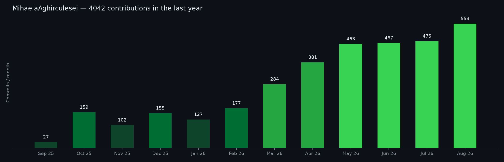
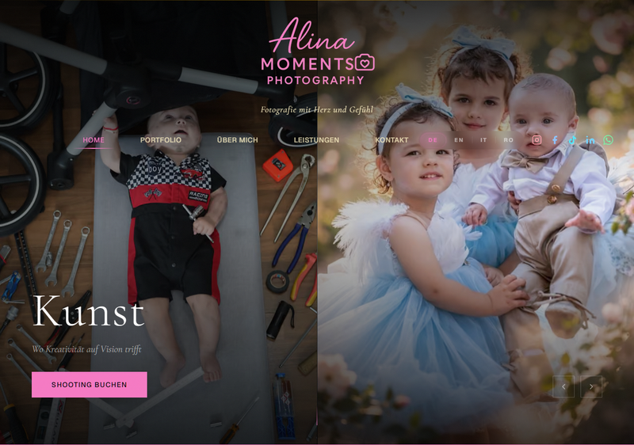
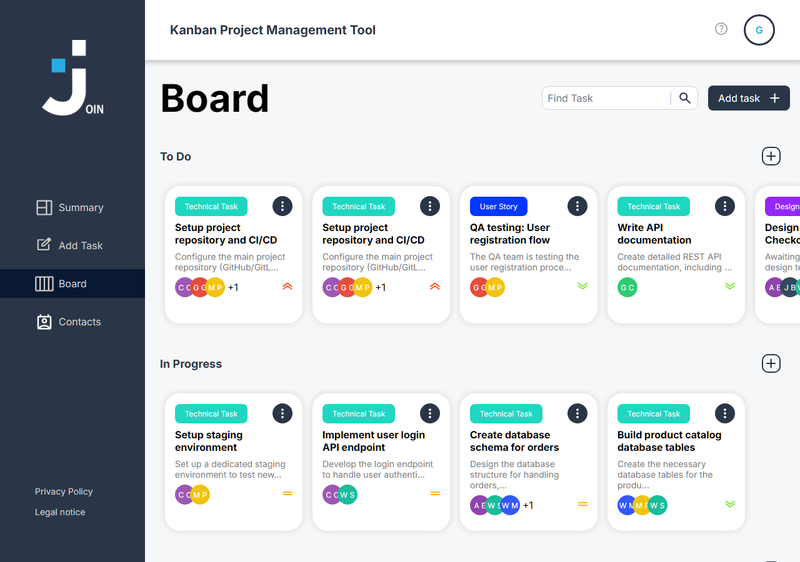
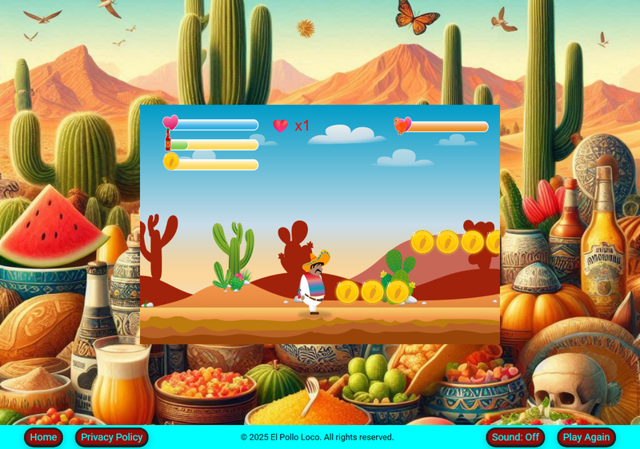
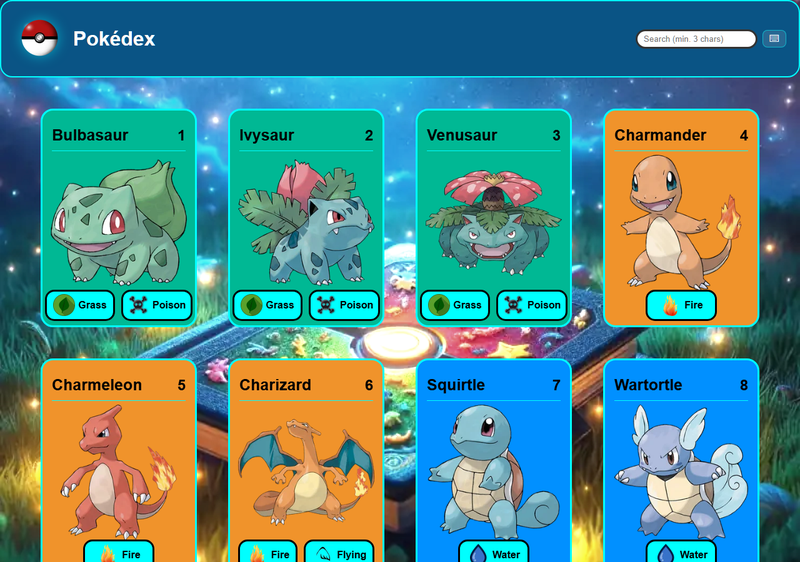
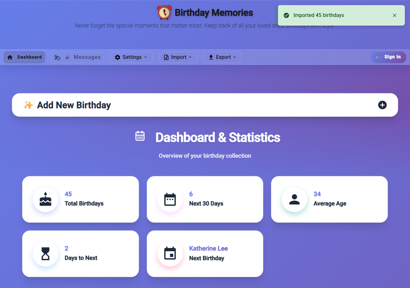

<div align="center">

# Hi there! 👋 I'm Mihaela Aghirculesei

### 🌐 Language / Sprache
[](README.md)
[](README.en.md)
[](README.it.md)

**Fullstack Developer** specializing in Angular, TypeScript & Python

[](mailto:aghirculesei@gmail.com)

[](https://github.com/MihaelaAghirculesei)


[](https://aghirculesei.pages.dev/)
[](https://www.linkedin.com/in/mihaela-aghirculesei-84147a23b/)
[](mailto:aghirculesei@gmail.com)


</div>

---

## 📊 GitHub Stats

<div align="center">

| GitHub Stats | GitHub Streak |
|--------------|---------------|
|  |  |

### Activity Graph



### Top Languages


</div>

---

## 👩‍💻 About Me

Software developer with a TÜV-certified qualification in Germany and several live, production applications — including a client website I built end-to-end, from architecture to deployment, on my own. My focus is on TypeScript-based web applications with Angular and React/Next.js, backed by automated tests, CI quality gates, and WCAG-compliant accessibility. From several years of experience in project coordination, I also bring a trained eye for requirements clarification, schedule management, and clear communication across departments.

```typescript
const mihaela = {
  location: "🌍 Europe",
  code: ["TypeScript", "JavaScript", "Python", "HTML", "CSS"],
  technologies: {
    frontend: ["Angular 17 & 19", "React 18/19", "Next.js 16", "RxJS", "NgRx", "Tailwind CSS", "Material Design", "PWA"],
    mobile: ["Capacitor 7 (Android)"],
    backend: ["FastAPI", "SQLAlchemy", "PostgreSQL", "Firebase", "Firestore", "Google Calendar API", "IndexedDB", "SQLite"],
    quality: ["Vitest", "Playwright", "Cypress", "axe-core", "GitHub Actions CI/CD"],
    tools: ["Git", "VS Code", "Figma", "Vercel"]
  },
  currentFocus: "Production-grade React/Next.js apps, advanced Angular patterns & Python backends",
  openTo: "Fullstack Developer opportunities"
};
```

---

## 💼 Background

**Freelance Web & App Development** — Self-employed · since 10/2025
End-to-end development of web applications for clients – from requirements gathering to deployment, including a booking website with an appointment scheduling system and automated communication. More of my own projects below ↓

**TÜV-certified Software Developer Qualification** — Developer Akademie GmbH · 10/2024 – 10/2025
18 modules, 12+ projects – several as part of SCRUM/Kanban teams. Focus: Angular, TypeScript, REST APIs, Firebase, test automation, UI/UX (Figma).

*Before that: several years of experience as a project coordinator on technical development projects (automotive/IT) – requirements management, Jira, stakeholder alignment across international teams of up to 150 people.*

---

## 🎨 Featured Projects

### 📸 [Alina Moments Photography](https://alina-moments-photography.vercel.app) · Client project
Production-grade portfolio website for a photographer – built end-to-end on my own, from architecture to live deployment (402 commits, 48 merged pull requests).



- **Quality:** ≥95% test coverage (Codecov), Lighthouse ≥95 (Accessibility), ≥90 (SEO), CLS ≤ 0.1 – enforced by blocking CI gates on every pull request
- **CI/CD:** Full GitHub Actions pipeline with lint, type-check, unit/E2E tests, coverage gate, bundle-size budget (≤500 KB), and automated Lighthouse audits
- **Security:** Per-request nonce-based CSP, atomic rate limiting, stateless HMAC authentication for review moderation, HSTS
- **Accessibility:** WCAG 2.1 AA – full keyboard navigation, focus trap, automated axe-core audits
- **i18n:** 4 languages (DE/EN/RO/IT) with next-intl, localized routing, multilingual SEO

**Tech:** Next.js 16 (App Router, RSC) • React 19 • TypeScript • Tailwind CSS 4 • PostgreSQL (Neon) • Drizzle ORM • Vercel

### 🔥 [Join Kanban Board](https://join-aghirculesei.pages.dev/) · Team project (5 developers)
A modern project management platform for effective team collaboration (478 team commits, 24 unit tests). Built with Angular 17 and Firebase, Join offers real-time synchronization, intuitive Kanban boards, and powerful tools for your team.



**Tech:** Angular 17 standalone components • Firebase Realtime Database • Drag & Drop interface (Angular CDK) • Multi-user authentication

### 🚀 [El Pollo Loco](https://el-pollo-loco-aghirculesei.pages.dev/)
An action-packed 2D jump-and-run game featuring Pepe as the main character (207 commits, 20 object-oriented classes). Collect coins and bottles, defeat enemies, and master challenging levels in this exciting adventure.



**Tech:** HTML5 canvas game engine • Vanilla JavaScript ES6+ • OOP design patterns • Custom audio pooling • Pixel-perfect collision detection • Mobile touch controls • 60 FPS performance optimization

### 💡 [Pokédex](https://pokedex-aghirculesei.pages.dev/)
Single-page app with PokéAPI integration, real-time search, and full keyboard navigation. Offline-first PWA with 243 unit and 21 E2E tests at 100% coverage, backed by automated CI/CD.



**Tech:** TypeScript (strict mode) • Vite • Vitest • Playwright • Workbox PWA • Lighthouse CI • Husky + lint-staged

### 🎂 [Birthday Memories](https://birthday-reminder-aghirculesei.pages.dev/)
A cross-platform birthday reminder app with offline-first architecture and cloud sync (1,074 commits, 117 unit and 20 E2E tests). Features native Android notifications via Capacitor, two-way Google Calendar sync, and real-time Firestore sync for authenticated users.



**Tech:** Angular 19 (Signals, SSR, standalone) • NgRx 19 • Capacitor 7 (Android) • Firebase Auth + Firestore • Google Calendar API v3 + OAuth 2.0 • IndexedDB offline-first • PWA • Cypress 20 E2E • Sentry

### 🐍 [Todo Platform](https://github.com/MihaelaAghirculesei/todo-platform) · Team project (2 developers)
A fullstack Todo app with a RESTful API and React frontend, built as a team (84 team commits). **My contribution: the complete backend** (FastAPI + SQLAlchemy 2.0) — clean layered architecture (Router → Service → Repository) with full CRUD implementation, input validation, and 23/23 tests passing. The REST API was designed so my teammate could build the React frontend against it independently. SQLite locally · PostgreSQL in production.


🌐 **Live:** [todo-frontend-aghirculesei.onrender.com](https://todo-frontend-aghirculesei.onrender.com)

**Tech:** Python 3.13 • FastAPI 0.115 • SQLAlchemy 2.0 • SQLite • PostgreSQL • React 18 • TypeScript 5 • Vite • Pytest • Pydantic 2

---

## 🛠️ Tech Stack

**Frontend**


**Mobile & PWA**


**Backend**


**Testing**


**Tools**


---

## 🌍 Languages & Availability

- **Romanian, Italian** — Native
- **German** — Business fluent (professional experience exclusively in German)
- **English** — B1 (reading/writing), A1 (speaking, actively improving)

🇪🇺 EU citizenship (Romania & Italy) — full right to work in Germany & the entire EU, no visa or sponsorship required.

---

## 📫 Let's Connect

I'm always open to interesting conversations and collaboration opportunities!

<div align="center">

[](https://aghirculesei.pages.dev/)
[](https://www.linkedin.com/in/mihaela-aghirculesei-84147a23b/)
[](mailto:aghirculesei@gmail.com)

</div>

---

<div align="center">

### ⭐ *"Good code is its own best documentation."* – Steve McConnell

**If you find my work interesting, consider giving a ⭐ to my repositories!**


</div>
