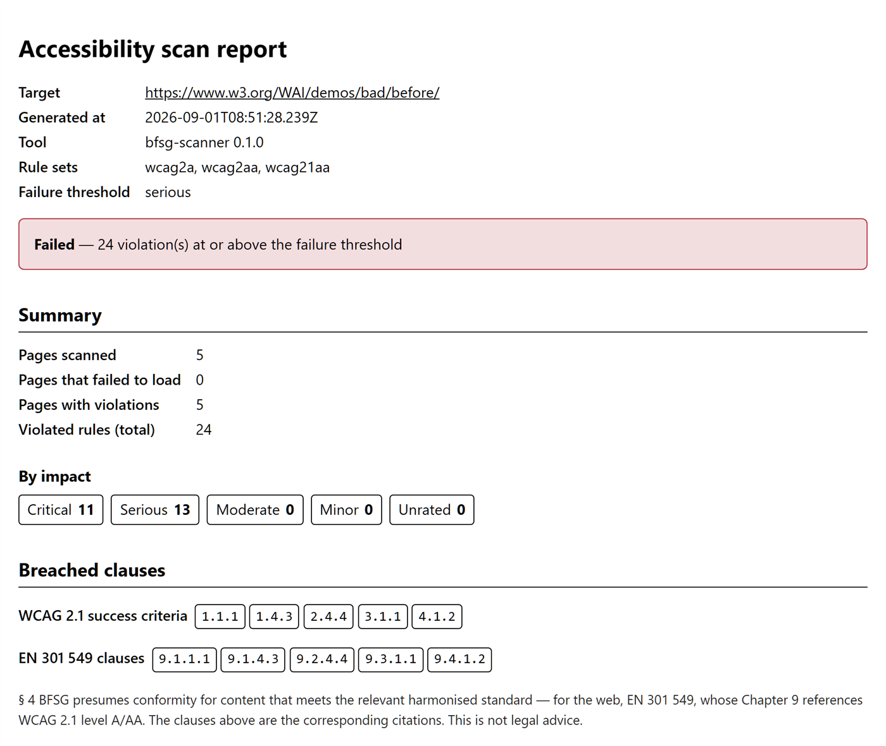
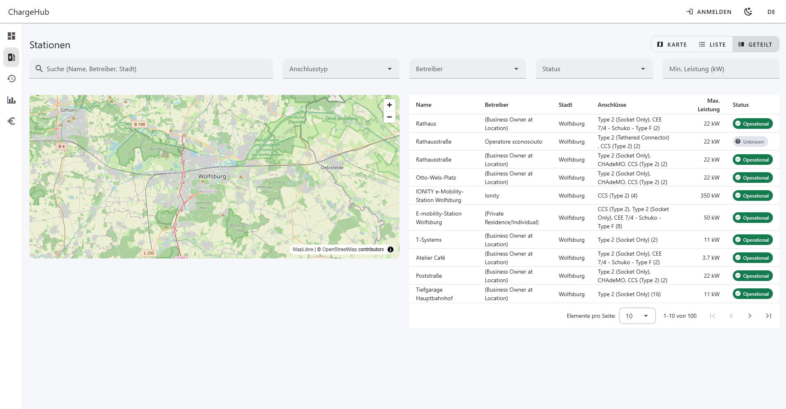
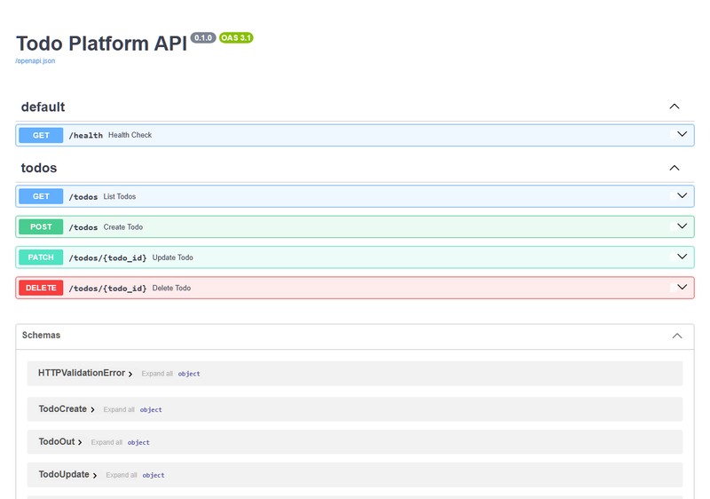

<div align="center">

# Mihaela Aghirculesei

### 🌐 Language / Sprache
[](README.md)
[](README.en.md)
[](README.it.md)

**Fullstack-Entwicklerin mit Frontend-Fokus** — Angular · TypeScript · Python / FastAPI

[](mailto:aghirculesei@gmail.com)
[-30363d?style=for-the-badge)](#-verfügbarkeit)

[](https://github.com/MihaelaAghirculesei)


[](https://aghirculesei.pages.dev/)
[](https://www.linkedin.com/in/mihaela-aghirculesei-84147a23b/)
[](mailto:aghirculesei@gmail.com)


</div>

---

## 👩‍💻 Über mich

Softwareentwicklerin mit B.Sc. Wirtschaftsinformatik und TÜV-zertifizierter Qualifizierung. Ich baue wartbare Web-Anwendungen mit **Angular & TypeScript**, ergänzt um **Python/FastAPI-Backends** und **Next.js / React**. Mehrere Anwendungen laufen im Live-Betrieb – darunter eine Kundenwebsite, die ich eigenverantwortlich von der Architektur bis zum Deployment umgesetzt habe.

Davor mehrere Jahre **Projektkoordination** in Automotive- und IT-Entwicklungsprojekten: Anforderungsmanagement, Jira/DMS, Freigabeprozesse und Moderation von Abstimmungsrunden mit bis zu 150 Teilnehmenden. Diese Doppelperspektive – Umsetzung **und** Koordination – bringe ich in jedes Team ein.

- 🌍 Wolfsburg, Deutschland · offen für Remote innerhalb der EU
- 🇪🇺 EU-Staatsangehörigkeit (Rumänien & Italien) – keine Arbeitserlaubnis oder Sponsoring erforderlich
- 🗣️ Rumänisch & Italienisch (Muttersprache) · Deutsch C1 · Englisch B1 (Lesen/Schreiben)
- ♿ Schwerpunkt Barrierefreiheit (WCAG 2.1 AA / BFSG) und automatisierte Qualitätssicherung

```typescript
const mihaela = {
  role: "Fullstack-Entwicklerin (Frontend-Fokus)",
  location: "Wolfsburg, DE · Remote (EU)",
  languages: ["TypeScript", "JavaScript", "Python", "HTML", "CSS"],
  frontend: ["Angular 17–19", "RxJS", "NgRx", "Signals", "React 18/19", "Next.js", "Vue 3 / Nuxt", "Tailwind CSS", "PWA"],
  backend:  ["FastAPI", "SQLAlchemy 2.0", "Pydantic", "PostgreSQL", "Firebase / Firestore", "REST", "WebSocket"],
  quality:  ["Vitest", "Playwright", "Cypress", "Pytest", "axe-core", "GitHub Actions CI/CD"],
  focus:    "Wartbare Angular-Architekturen, Python-Backends, Barrierefreiheit",
};
```

---

## 📊 GitHub-Statistiken

<div align="center">

| GitHub Stats | GitHub Streak |
|--------------|---------------|
|  |  |

### Aktivitätsverlauf


### Meistgenutzte Sprachen


</div>

---

## 🎨 Ausgewählte Projekte

### 📸 [Alina Moments Photography](https://alina-moments-photography-2026.vercel.app) · Kundenprojekt
Produktionsreife Portfolio-Website für eine Fotografin – eigenverantwortlich von der Architektur bis zum Live-Deployment umgesetzt (402 Commits, 48 gemergte Pull Requests).


- **Qualität:** ≥95 % Testabdeckung (Codecov), Lighthouse ≥95 (Accessibility), ≥90 (SEO), CLS ≤ 0,1 – abgesichert durch CI-Gates bei jedem Pull Request
- **CI/CD:** GitHub-Actions-Pipeline mit Lint, Type-Check, Unit-/E2E-Tests, Coverage-Gate, Bundle-Size-Budget (≤ 500 kB) und automatisiertem Lighthouse-Audit
- **Sicherheit:** Nonce-basierte CSP, atomares Rate-Limiting, HMAC-Authentifizierung für Rezensions-Moderation, HSTS
- **Barrierefreiheit:** WCAG 2.1 AA – vollständige Tastaturnavigation, Focus-Trap, automatisierte axe-core-Audits
- **Mehrsprachigkeit:** 4 Sprachen (DE/EN/RO/IT) mit next-intl, lokalisiertes Routing, mehrsprachiges SEO

**Tech:** Next.js 16 (App Router, RSC) • React 19 • TypeScript • Tailwind CSS 4 • PostgreSQL (Neon) • Drizzle ORM • Vercel

### 📦 [bfsg-scanner](https://www.npmjs.com/package/bfsg-scanner) · Open-Source npm-Paket
Kommandozeilen-Tool, das eine komplette Website auf WCAG-2.1-AA-Verstöße prüft und jeden Fund der EN-301-549-/BFSG-Klausel zuordnet, gegen die er verstößt – als zitierfähigen Konformitätsbericht in JSON/HTML/PDF. Entwickelt in 28 einzeln reviewten Pull Requests, die meisten mit einem Architecture Decision Record.



🌐 **Live-Beispielbericht:** [mihaelaaghirculesei.github.io/bfsg-scanner](https://mihaelaaghirculesei.github.io/bfsg-scanner/)

- **Supply-Chain:** auf npm veröffentlicht mit SLSA-Build-Provenance über OIDC Trusted Publishing – keine langlebigen Tokens
- **Qualität:** 146 Tests, CI auf Linux/Windows/macOS, versioniertes JSON-Schema für die Bericht-Ausgabe, semantische Exit-Codes
- **Engine:** Sitemap- + robots.txt-bewusster Breadth-First-Crawl, Concurrency-Pool mit Per-Host-Rate-Limit, echtes Chromium via Playwright + axe-core
- **CI-Gate:** Exit-Code ≠ 0 ab konfigurierbarer Schweregrad-Schwelle – so kann eine Pipeline den Merge auf Barrierefreiheit blockieren

**Tech:** TypeScript • Node.js 24 • Playwright • axe-core • Zod • Vitest • Biome • GitHub Actions

### 🎂 [Birthday Memories](https://birthday-reminder-aghirculesei.pages.dev/)
Eine plattformübergreifende Geburtstags-App mit Offline-First-Architektur und Cloud-Synchronisierung (1.074 Commits, 117 Unit- und 20 E2E-Tests). Native Android-Benachrichtigungen via Capacitor, bidirektionale Google Calendar-Synchronisierung und Echtzeit-Firestore-Sync für angemeldete Nutzer.


**Tech:** Angular 19 (Signals, SSR, Standalone) • NgRx 19 • Capacitor 7 (Android) • Firebase Auth + Firestore • Google Calendar API v3 + OAuth 2.0 • IndexedDB Offline-First • PWA • Cypress 20 E2E • Sentry

### ⚡ [ChargeHub](https://github.com/MihaelaAghirculesei/ChargeHub) 
Dashboard für EV-Ladeinfrastruktur, aktuell in aktiver Entwicklung – bereits live und funktionsfähig. Weitere Details folgen nach Fertigstellung.



🌐 **Live:** [charge-hub-one.vercel.app](https://charge-hub-one.vercel.app/de)

**Tech:** Nuxt 4 • Vue 3 • Vuetify 3 • TypeScript • Pinia • MapLibre GL • Chart.js

### 🐍 [Todo API](https://github.com/MihaelaAghirculesei/todo-api) · Teamprojekt (2 Entwickler)
Fullstack-Todo-App mit RESTful API und React-Frontend, im Team entwickelt (84 Commits im Team). **Mein Beitrag: das komplette Backend** (FastAPI + SQLAlchemy 2.0) — saubere Schichtarchitektur (Router → Service → Repository) mit vollständiger CRUD-Implementierung, Eingabevalidierung und 23/23 Tests. Die REST-API wurde so entworfen, dass mein Teampartner unabhängig das React-Frontend dagegen entwickeln konnte. SQLite lokal · PostgreSQL in Produktion.



🌐 **Live (Team-Plattform):** [todo-frontend-aghirculesei.onrender.com](https://todo-frontend-aghirculesei.onrender.com)

**Tech:** Python 3.13 • FastAPI 0.115 • SQLAlchemy 2.0 • SQLite • PostgreSQL • React 18 • TypeScript 5 • Vite • Pytest • Pydantic 2

### 🍽️ dineos 
Echtzeit-Bestellsystem für die Gastronomie: QR-Code am Tisch → Bestellung → Küchen-Board in Echtzeit über WebSocket, Bezahlung via Stripe. Geschichtete FastAPI-Architektur mit Angular/NgRx-Frontend. Details und Kennzahlen folgen.

**Tech:** FastAPI • WebSocket • SQLAlchemy • PostgreSQL • Angular • NgRx • Stripe
🔒 Privates Repository · Case Study & Code auf Anfrage

### 📚 normeon · RAG für deutsche technische Dokumentation 
Retrieval-Augmented-Generation-Assistent, der Fragen zu deutschsprachigen technischen Normen mit quellengenauen Zitaten beantwortet. Noch in aktiver Entwicklung – weitere Details und Kennzahlen folgen.

**Tech:** Python • Retrieval-Augmented Generation • Vektorsuche
🔒 Privates Repository · Case Study auf Anfrage

---

*Ausbildungsprojekte (TÜV-zertifizierte Qualifizierung, Developer Akademie):*

### 💡 [Pokédex](https://pokedex-aghirculesei.pages.dev/)
Single-Page-Anwendung mit PokéAPI-Integration, Echtzeit-Suche und vollständiger Keyboard-Navigation. Offline-First-PWA mit 243 Unit- und 21 E2E-Tests bei 100 % Coverage, abgesichert durch automatisiertes CI/CD.


**Tech:** TypeScript (Strict Mode) • Vite • Vitest • Playwright • Workbox PWA • Lighthouse CI • Husky + lint-staged

### 🔥 [Join Kanban Board](https://join-aghirculesei.pages.dev/) · Teamprojekt (5 Entwickler)
Eine moderne Projektmanagement-Plattform für effektive Teamzusammenarbeit (478 Commits im Team, 24 Unit-Tests). Mit Angular 17 und Firebase bietet Join Echtzeit-Synchronisierung, intuitive Kanban-Boards und leistungsstarke Tools für Ihr Team.


**Tech:** Angular 17 Standalone Components • Firebase Realtime Database • Drag & Drop-Oberfläche (Angular CDK) • Multi-User-Authentifizierung

### 🚀 [El Pollo Loco](https://el-pollo-loco-aghirculesei.pages.dev/)
Ein actionreiches 2D-Jump-and-Run-Spiel mit Pepe als Hauptfigur (207 Commits, 20 objektorientierte Klassen). Sammle Münzen und Flaschen, besiege Gegner und meistere herausfordernde Level in diesem spannenden Abenteuer.


**Tech:** HTML5 Canvas (kein Game-Framework) • Vanilla JavaScript (ES2022) • OOP-Designmuster • Custom Audio Pooling • pixelgenaue Kollisionserkennung • Mobile Touch-Steuerung • ~60 FPS

---

## 🛠️ Tech-Stack

**Sprachen**


**Frontend**


**Mobile & PWA**


**Backend & Daten**


**Testing & Qualität**


**Tools & Infrastruktur**


---

## 💼 Werdegang

**Freelance Web- & App-Entwicklung** — Selbstständig · seit 10/2025
Eigenverantwortliche Entwicklung von Web-Anwendungen – von der Anforderungsaufnahme bis zum Deployment, mit Schwerpunkt auf Terminbuchungssystemen und automatisierten Kommunikationslösungen.

**TÜV-zertifizierte Qualifizierung zur Softwareentwicklerin** — Developer Akademie GmbH · 10/2024 – 10/2025
18 Module, 12+ Projekte – mehrere davon im Team nach SCRUM/Kanban. Schwerpunkte: Angular, TypeScript, REST-APIs, Firebase, Testautomatisierung, UI/UX (Figma).

**Projektkoordination – Automotive & IT** — Ferchau Automotive, jSERVICE · 2023 – 2024
Anforderungsmanagement, Arbeitspaket- und Terminsteuerung in Jira/DMS, Koordination internationaler Freigabeprozesse für Fahrerassistenzsysteme, Moderation von Abstimmungsrunden mit bis zu 150 Teilnehmenden.

**B.Sc. Wirtschaftswissenschaft & Wirtschaftsinformatik** — George-Bacovia-Universität, Bacău (RO)
Anerkennung durch KMK/ZAB: entspricht einem deutschen Hochschulabschluss auf Bachelor-Ebene.

---

## 🌍 Verfügbarkeit

- **Rollen:** Fullstack-Entwicklerin (Frontend-Fokus) · Frontend-Entwicklerin (Angular / TypeScript)
- **Standort:** Wolfsburg · Remote innerhalb der EU
- **Sprachen:** Rumänisch & Italienisch (Muttersprache) · Deutsch C1 (gesamte Berufserfahrung auf Deutsch) · Englisch B1 (Lesen/Schreiben), A2 (Sprechen)
- 🇪🇺 **EU-Staatsangehörigkeit** (Rumänien & Italien) – uneingeschränkte Arbeitserlaubnis in Deutschland und der gesamten EU, kein Visum, kein Sponsoring.

---

## 📫 Kontakt

<div align="center">

[](https://aghirculesei.pages.dev/)
[](https://www.linkedin.com/in/mihaela-aghirculesei-84147a23b/)
[](mailto:aghirculesei@gmail.com)


</div>
